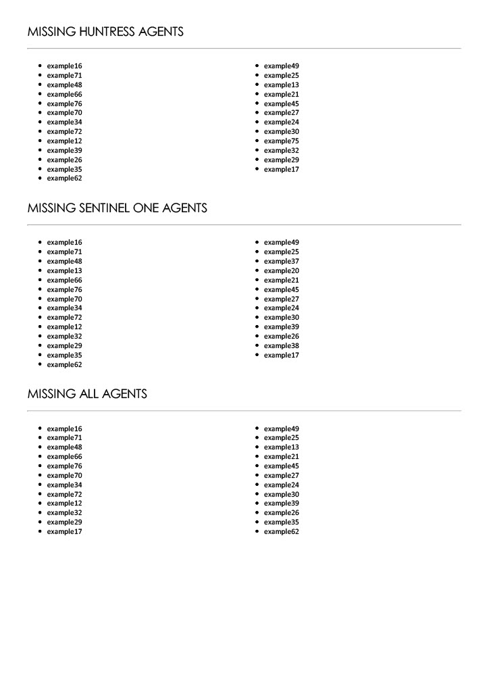

# Introduction 

We have developed a utility to automate the True Up reporting process for Solis Security clientele. The application works by pulling in CSV files for each company which list out hosts/endpoints and whether or not security tools (SentinelOne, Huntress, etc.) 
are installed on the host. After pulling this data from the CSV, the utility compiles a PDF report for the client listing which hosts are missing each security tool provided. 

# Getting Started
TODO: Guide users through getting your code up and running on their own system. In this section you can talk about:
1.	Install needed Python modules by executing the following from the command line:

```
pip install -r requirements.txt
```
2.	To run the program with default parameters use the command

```
python DCU.py
```
3. We recommend keeping the proccessor count limited to 3 or 4. In our testing we found 4 processes yielded the best output of 30 seconds.

# Example
An example output on a file with the command
```
python DCU.py
```


# Problems and Recommendations
### There is no error below that causes a PDF file to be skipped or not produced.
1. There is currently a race condition that occurs when two processes are trying to access one CSV file that has not been put in the used list.
2. Completion times are inconsistent where the best is 30 seconds and the worst is 2 minutes. It is very dependent on the race condition described above.
3. There is an error where a process tries to grab an HTML file that doesn't exist. We couldn't find a way to replicate it but every PDF file is still produced.

# Contribute
For any new services that needs to be added the user can simply add to the SERVICES section in the config file. The format being the key is the name found in the csv file and the value is the desired string output
